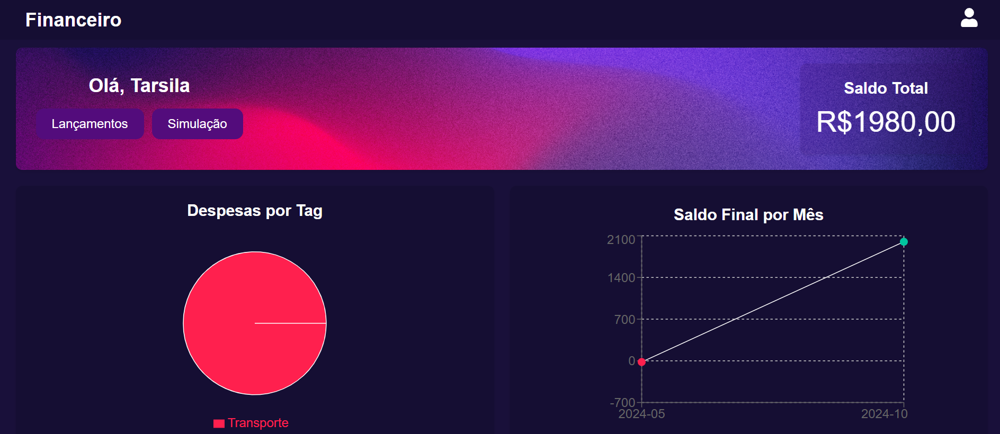
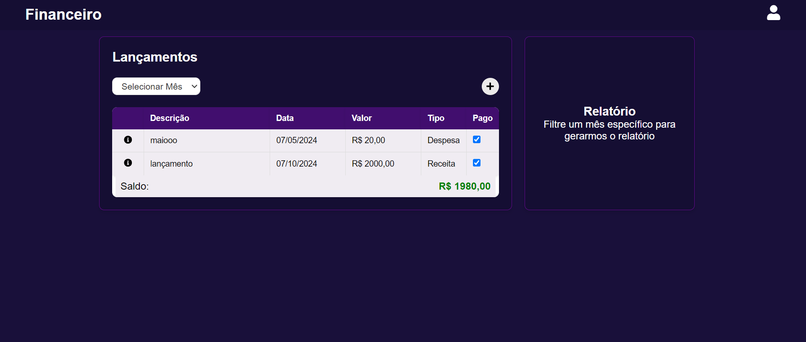
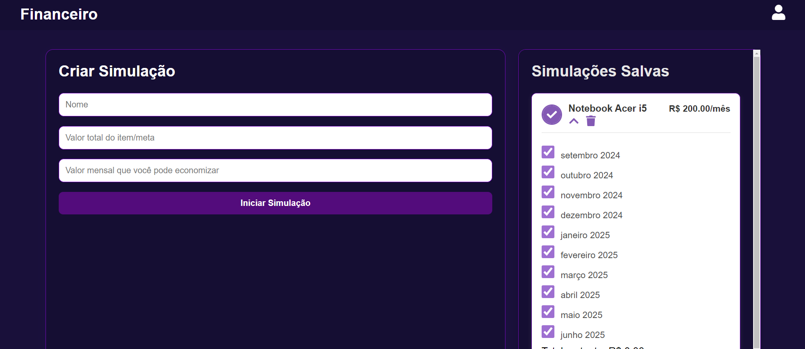

# 🪙 Financeiro



 


## 📌 Descrição do Projeto

Este projeto é uma aplicação web de gestão financeira pessoal, desenvolvida como Projeto Integrador para o curso de desenvolvimento Full-Stack - Rio Pomba Valley. A plataforma permite aos usuários cadastrar receitas e despesas, visualizar gráficos de gastos por categoria e realizar simulações financeiras. O sistema foi projetado para fornecer aos usuários uma ferramenta eficiente de controle financeiro, ajudando-os a tomar decisões informadas e gerenciar melhor suas finanças.

## Funcionalidades

- **Autenticação de Usuário**: Cadastro, login e recuperação de senha.
- **Gerenciamento de Finanças**: Cadastro, edição e exclusão de receitas e despesas.
- **Simulações Financeiras**: Permite realizar simulações financeiras para planejamento futuro.
- **Visualização de Gráficos**: Gráficos interativos mostrando gastos por categoria e por mês.
- **Painel Resumido**: Visão geral do saldo total e uma visão clara da situação financeira.

## Tecnologias Utilizadas

### Backend

- **Node.js** e **Express**: Usados para criar o servidor e as APIs.
- **MySQL**: Sistema de banco de dados relacional para armazenar receitas e despesas.
- **Sequelize**: ORM para facilitar a interação com o banco de dados MySQL.
- **bcrypt**: Para segurança no armazenamento de senhas.
- **JWT** (jsonwebtoken): Usado para autenticação e autorização de usuários.

### Frontend

- **React**: Biblioteca principal para criação de interfaces de usuário dinâmicas.
- **Axios**: Utilizado para fazer requisições HTTP ao backend.
- **Recharts**: Biblioteca para visualização de dados com gráficos interativos.
- **React Router Dom**: Gerenciamento de rotas no frontend.
- **React Toastify**: Para exibir notificações de feedback ao usuário.

## Instalação

### Pré-requisitos

- [Node.js](https://nodejs.org/) instalado.
- [MySQL](https://www.mysql.com/) instalado e rodando.

### Passos

1. Clone este repositório:
    ```bash
    git clone https://github.com/tarsibfritz/ProjetoIntegrador-Financeiro.git
    ```

2. Entre na pasta do projeto:
    ```bash
    cd ProjetoIntegrador-Financeiro
    ```

3. Abra um terminal para instalar as dependências do backend e iniciar o servidor:
    ```bash
    cd backend
    npm install
    cd src
    node server.js
    ```

4. Abra outro terminal para instalar as dependências do frontend e iniciar o servidor:
    ```bash
    cd ../frontend
    npm install
    npm run dev
    ```

5. Configure o arquivo `.env` com suas credenciais de banco de dados e outras variáveis de ambiente:
    ```bash
    DB_HOST=localhost
    DB_USER=seu-usuario
    DB_PASSWORD=sua-senha
    DB_NAME=nome-do-banco
    ```

## Uso

- Acesse a aplicação em `http://localhost:5173` após iniciar o servidor frontend.
- Use a interface para criar uma conta, fazer login e gerenciar suas finanças pessoais.

## Próximos Passos

Os aprimoramentos futuros para o projeto incluem:
- Relacionamento entre usuários e suas despesas/receitas no banco de dados.
- Emissão de relatórios financeiros em formatos como PDF.
- Melhorias de segurança no backend.
- Desenvolvimento de uma versão mobile responsiva.
- Criação de uma página de configurações do usuário.